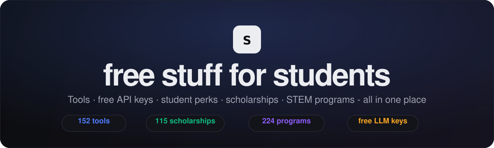

<div align="center">



<h1>🎓 stdnt.xyz</h1>

### Every free thing you can get as a student - in one fast, searchable page.

Tools · **free LLM API keys** · student perks · **115 scholarships** · **224 STEM programs**

<p>
  <a href="#-quick-start"></a>
  
  
</p>

<p>
  
  
  
  
  
</p>

<sub>⭐ Star it · 🔁 share it · 🛠️ PR your favourite freebie</sub>

</div>

---

## 🤔 Why this exists

Your `.edu` email (and honestly, just *being online*) unlocks **thousands of dollars** of free software, AI, hosting, scholarships and programs - but it's scattered across a hundred pages, blog posts and Google Sheets that quietly stop being updated.

So this pulls the best of it into **one minimalist site you can actually search**:

- 🎁 **Student packs** - GitHub Student Developer Pack ($200k+), Azure, Notion…
- 🤖 **AI tools** - Copilot, Cursor, Perplexity & Gemini for students
- 🔑 **Free API keys** - Gemini, Groq, Cerebras, OpenRouter, Hugging Face, Hack Club AI & more
- 🚩 **Hack Club** - free hardware, Slack, HCB, Brilliant Premium, CDN…
- 💻 **Dev / cloud / design / productivity** - JetBrains, Vercel, Figma, Microsoft 365…
- 💰 **115 scholarships** - from full-rides to "describe your zombie-apocalypse escape plan"
- 🔬 **224 STEM programs** - research, internships & summer programs, filterable by grade

> Built to be the live home for community scholarship/program spreadsheets that
> *"will no longer be updated"* - so nothing good gets lost.

## ✨ Features

| | |
|---|---|
| 🔎 **Instant search** | filter everything as you type (`/` to focus, `Esc` to clear) |
| 🗂️ **6 tabs** | Tools & Perks · Scholarships · STEM Programs · For You · Saved · About |
| ✦ **"For You" quiz** | answer a few questions (income, background, grade…) and get matched to scholarships & programs, all computed on-device |
| ⭐ **Save to list** | star any item to build a personal list (saved on-device) |
| 🎚️ **Smart filters** | segmented access toggle, category/type/grade chips, free-only |
| ↕️ **Sorting** | by amount, **closing soon**, deadline, prestige, or **acceptance rate** |
| 📅 **Deadlines** | "closing soon" badges + one-click **add-to-Google-Calendar**, and **.ics** export |
| 🔗 **Shareable matches** | your quiz answers encode into a link you can send to anyone |
| 📤 **Export saved** | copy, download **CSV**, export deadlines as **.ics**, or print |
| ➕ **Submit a resource** | a button opens a prefilled GitHub issue, no coding needed |
| 🏷️ **Real brand logos** | via [Simple Icons](https://simpleicons.org), with clean monogram fallbacks |
| 🌗 **Dark / light** | system-aware, remembers your choice |
| 👁️ **Live view counter** | because watching it climb is fun |
| ⚡ **Zero dependencies** | pure HTML/CSS/JS - loads instantly, deploys anywhere |

## 🚀 Quick start

```bash
git clone https://github.com/2008wbbv/edu.edu stdnt.xyz
cd stdnt.xyz
python3 -m http.server 8000   # then open http://localhost:8000
```

…or just open `index.html`. That's the whole setup. No `npm install`, no toolchain.

### Deploy free on GitHub Pages
**Settings → Pages → Deploy from a branch → `main` / `root`.** Done. (`.nojekyll` is included.)

## 🧩 Project structure

```
stdnt.xyz/
├── index.html          # markup + the tabs
├── css/styles.css      # minimalist theme
├── js/
│   ├── data.js         # 👈 tools, perks & free APIs
│   ├── scholarships.js # 👈 scholarship directory
│   ├── programs.js     # 👈 STEM programs (generated from community sheets)
│   └── app.js          # render, search, filter, sort, theme, counter
└── assets/banner.svg
```

## ➕ Add a freebie (it's one object)

Open `js/data.js` and add to `window.RESOURCES`:

```js
{
  name: "Cool Free Thing",
  url: "https://example.com/",
  category: "apis",        // see window.CATEGORIES
  access: "everyone",      // "student" or "everyone"
  slug: "github",          // a simpleicons.org slug (or omit for a monogram)
  value: "$50 credit",     // optional highlight
  desc: "One honest sentence about what it is.",
  tags: ["llm", "api"]     // optional, helps search
}
```

Counts, chips, search and the icon all update automatically. Scholarships and programs
follow the same idea in their files. **PRs that add or fix freebies are the whole point -
send them.** 💛

## 🙏 Credits

- Scholarship & STEM-program data adapted from open community spreadsheets.
- Inspired by Richard O.'s MIT Admissions blog, [*"Where the Free Things Are."*](https://mitadmissions.org/blogs/entry/where-the-free-things-are/)
- Brand icons by [Simple Icons](https://simpleicons.org). View counter by [Abacus](https://abacus.jasoncameron.dev).

## ⚖️ A note

This is for *discovering* things you'll genuinely enjoy - **not** a checklist to grind.
Pick a few, go deep, ignore the rest. Offers change, so always confirm on the provider's site.

<div align="center"><sub>MIT licensed · made for students, by students</sub></div>
